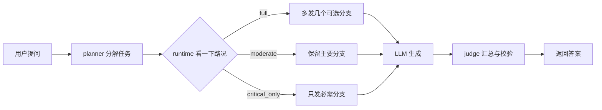

# SpecNet-Agent 小白入门指南

> 读法与一般教材相反：先看“为什么要做”，再看“怎么做”，然后看“为什么可能有用”，最后才学专有名词。

## 0. 先不要背单词

想象你在管理一座只有一座桥的城市。一个客户来了，他的任务可能需要：

- 一辆必须到达的救护车；
- 几辆可能帮助工作做得更好的备用车；
- 一些不影响当前交付的后台车。

桥宽固定。如果把所有车都放上去，备用车会和救护车抢路；如果只放救护车，答案可能比较粗糙。

SpecNet-Agent 要解决的就是这个问题：

> 在网络变堵、任务快到截止时，是否应该少发一些可选请求？在网络空闲时，又是否可以多试几种方案？

这就是本项目的核心。它不是先发明一个复杂算法，而是先承认一个现实矛盾：“做得更多可能更好，但也可能更堵。”

## 1. 一个请求究竟经历了什么

把一次 agent 任务想成“从问题到答案的工作流程”：



每一步的意思是：

1. `planner` 先决定这个任务需要哪些工作。
2. 任务中有些工作是必须的，有些是“做了可能更好”。
3. 在发出后续分支之前，runtime 先读取当前网络情况。
4. 它选择一个发送强度，然后才创建分支。
5. 必须工作完成后，未用上的备用工作会被取消。

所以控制器的位置很关键：它在“请求还没有全部上路”之前做决定。

## 2. 这个项目是怎么设计的

控制器每次只需回答三个问题：

### 问题 A：现在路况怎么样？

- 路上还有多少流量？
- 这个 workflow 离截止时间还有多少余量？
- 当前系统里是不是已经有太多备用流？

代码将这三件事分别压缩成 `congestion`、`slack` 和 `spec_pressure` 三个简单档位。例如，不是使用 0.6731 这样的原始数字，而是先说“低、中、高拥堵”。

### 问题 B：可以选哪个档位？

项目预先写死了五个可选动作：

| 动作 | 直观画面 | 会做什么 |
|---|---|---|
| `critical_only` | 只让救护车过桥 | 只保留必需分支 |
| `conservative` | 只放少量备用车 | 低 fanout、少量后台流量 |
| `moderate` | 保留主路和少量支路 | 中等 fanout和后台比例 |
| `recovery` | 拥堵退去后慢慢恢复 | 比 moderate 更宽松 |
| `full` | 路况宽时全部放行 | 最大程度创建可选分支 |

### 问题 C：凭什么选这个动作？

项目使用一张表记录“某种路况下选某个动作的效果”。初期它会多试一些选择，随后根据完成结果调整这张表。

这个设计没有假装自己能预知未来。它只能根据当前信号做决定，再从实际结果中学习。

## 3. 为什么这个方法可能有用

### 3.1 少发一点可选流，就少一点抢路

假设每秒到达的请求是 `lambda`，每个请求平均需要发送 `E[B]` 字节，链路每秒最多能处理 `C` 字节，则大致负载率是：

```text
rho = lambda * E[B] / C
```

如果控制器关闭一些可选分支，`E[B]` 会下降，`rho` 也会下降。路上不那么堵，必须完成的流就有更好的机会按时通过。

### 3.2 先保证主干，再考虑备用

代码为不同类型的流设置了不同权重：必须完成的关键流优先于投机流和后台流。这不是说后台永远不重要，而是在拥堵时先保住当前要交付的答案。

### 3.3 紧急时少做备用工作，空闲时多试方案

如果离 deadline 只剩一点时间，再启动很多可选分支，就像在交付前临时开很多会议；如果还很富裕，多试几种方案可能提高答案质量。

因此这个控制器并不是永远追求“流量越少越好”，而是追求一个可接受的平衡点。

## 4. 现在才来认识专有名词

下面每个词都先回顾上面的故事，再给出学术名称。

### 4.1 任务、分支与网络

- 一次从用户问题到最终答案、中间有多个依赖步骤的工作，叫 **workflow（工作流）**。
- workflow 中的一条可传输工作，比如一次检索请求，叫 **flow（流）**。
- 一个任务同时开出几条并行分支，叫 **fanout（并发扩散度）**。
- 所有流都争用的那个最窄资源，比如这座桥，叫 **bottleneck（瓶颈）**。
- 系统主动送入网络的工作总量，叫 **offered load（提供负载）**。
- 当前流量太多、大家互相等待时，这种“堵车程度”叫 **congestion（拥堵）**。

### 4.2 哪些工作必须做

- 不做就无法完成当前任务的分支，叫 **required branch（必需分支）**。
- 做了可能提高结果，不做也可以交付的分支，叫 **optional branch（可选分支）**。
- 在还不知道用不用得上时先发出的可选分支，叫 **speculative branch（投机分支）**。这里的“投机”不是赌博，而是提前做一点可能有用的工作。
- 不阻塞当前答案、可以暂时让路的同步工作，叫 **background flow（后台流）**。
- 任务变得明确后，未完成的备用工作被停掉，叫 **branch cancellation（分支取消）**。已经传输的部分不能倒流，所以仍然算浪费。

### 4.3 时间和质量

- 任务最晚应该完成的时刻，叫 **deadline（截止期限）**。
- 现在到 deadline 还剩多少可用时间，叫 **slack（时间余量）**。本项目的 effective slack 还会扣除预计的剩余关键工作时间，所以不只是“截止时间减当前时间”。
- 最慢的那一小部分请求的速度，比如 100 个请求中最慢的几个，叫 **p99 latency（99 分位尾延迟）**。它回答的是“少数最倒的体验有多差”，不是平均速度。
- 已经发送、但最后没有帮上忙的投机字节，叫 **waste（浪费）**。
- 本模拟中用分支数量和动作档位估出来的质量分数，叫 **quality proxy（质量代理指标）**。它不是真实人类评分，这个区别很重要。

### 4.4 控制器是怎么学的

- 控制器看到的三个档位组合，叫 **state（状态）**。
- 可以选择的五个档位，叫 **action space（动作空间）**。
- “看到这种状态就选这个动作”的整套方法，叫 **policy（策略）**。
- 每次先看环境状况，再选一个动作，最后只根据这次结果学习，叫 **contextual bandit（上下文 bandit）**。它像是先看路况再选交通方案，但不会同时观察没选的方案。
- 一次任务结束后，用一个数概括快不快、浪不浪费、质量如何，这个数叫 **reward（奖励）**。奖励是学习用的评分，不是最终论文结论。
- 某个状态选某个动作的历史平均得分估计，叫 **Q-value（Q 值）**。
- 一边尝试不确定的动作，一边使用已知道比较好的动作，叫 **exploration-exploitation tradeoff（探索与利用的权衡）**。

### 4.5 实验是怎么证明或否定的

- 先运行一个完整策略，再只关掉其中一个状态信号，其他条件尽量不变，这种“拆掉一个零件看车怎么变”的实验，叫 **ablation（消融实验）**。例如 H1-C 关掉 `congestion`，H1-S 关掉 `slack`，H1-P 关掉 `spec_pressure`。
- 用来做参照的简单方法，叫 **baseline（基线）**。本项目的 `fixed_moderate` 就是强基线：如果它已经很好，复杂 bandit 就必须证明自己值得。
- 用同一批 workflow 分别给两种方法处理，叫 **matched pairing（匹配配对）**。这就像同一个人先后用两种药，比直接比两群完全不同的人更公平。
- 先在每个固定场景里比较，再让每个场景占同样权重，叫 **scenario-stratified estimand（场景分层估计对象）**。
- 从已有实验数据重复抽取，看差值的可能范围，叫 **bootstrap confidence interval（bootstrap 置信区间）**。
- 同时检查多个假设时，为了避免偶然撞上显著，用 **Holm correction（Holm 多重检验校正）**。
- 某个方法距离当前候选方法集合中最好可部署方法的额外成本，叫 **regret（遗憾值）**。
- 将训练 seed 换成其他数字后，策略是否还是类似，叫 **policy stability（策略稳定性）**。
- 能打印状态、动作、Q 值、访问次数和实验记录，叫 **auditability（可审计性）**。可审计只代表能查和复算，不代表策略一定正确。

### 4.6 模拟和部署边界

- 按一套设定的规则推进时间、流量和完成事件的程序，叫 **simulator（模拟器）**。
- 用生成的到达时间和 workflow 轨迹驱动模拟，叫 **trace-driven simulation（轨迹驱动模拟）**。
- 妉似“只能向前执行、不能回到已经完成的步骤”的依赖图，叫 **DAG（有向无环图）**。
- 为了防止危险动作超过最低质量、后台服务或关键路径要求而强制拦截的共享规则，叫 **guard（安全保护规则）**。当前 proof v2 为了比较控制器核心，统一关闭了 guard。

## 5. 用一个小例把词连起来

假设一个问题需要检索三个资料：

- 资料 A 是必须的；
- 资料 B 和 C 可以帮助改善答案，但不一定用得上；
- 目前网络很堵，距离 deadline 只剩一点时间。

这时控制器可能选 `critical_only`：先把 A 发完，不再让 B/C 抢路。如果网络变空闲，控制器可能选 `full`，同时请求 A/B/C。

这个小例中：

- “任务”就是 workflow；
- A/B/C 各自是 branch；
- B/C 是 optional branch；
- 同时开几个分支是 fanout；
- 桥是 bottleneck；
- “很堵”是 congestion；
- “时间只剩一点”是 tight slack；
- 选 `critical_only` 或 `full` 是 action；
- 记录这种路况下选什么的策略表是 policy；
- 把一个信号关掉再看结果，就是 ablation。

## 6. 如何阅读这个项目

不要一开始就跳进 Q-value 公式。按下面顺序读：

### 第一步：只看故事

先读本文第 0-3 节，弄懂一件事：“这个系统要在网络拥堵和答案质量之间做选择。”

### 第二步：对着五个 action 想画面

只记住：`critical_only` 是最保守，`full` 是最开放，`moderate` 在中间。暂时不必记住具体字节数。

### 第三步：再读状态和实验

然后看 `state_coverage.csv`、`claim_verdicts.csv` 和 `PROOF_REPORT.md`：

- `state_coverage.csv`：控制器真正见过哪些路况？
- `claim_verdicts.csv`：每个假设到底是支持还是不支持？
- `PROOF_REPORT.md`：差异有多大，不确定性有多大？

### 第四步：最后才看代码

建议代码阅读顺序是：

1. `proof_harness.py` 里的 `ACTION_CONFIG` 和 `ACTION_STRENGTH`：先看五个动作怎么不同。
2. `observable_state()` 和 `decide_action()`：再看控制器怎么看路况和选动作。
3. `on_workflow_complete()`：最后看它怎么根据结果更新记分。
4. RQ1/RQ2/RQ3 函数：最后再看实验是如何组织的。

## 7. 现在已经知道什么？

把本项目当前结果翻译成大白话：

- 不看 `congestion`，高拥堵时尾延迟会变坏，所以这个信号有价值。
- 不看 `slack`，紧急任务会更容易超时，但完整策略可能以一部分质量换时间。
- 当前没有证明 `spec_pressure` 是减少 waste 的必要信号；可能是它测量得不够准。
- 复杂 bandit 不一定比简单的 `fixed_moderate` 好，因为训练分数和部署想要的分数可能不一样。
- 策略可以被打印出来检查，但换一个随机 seed 后不一定还会选同一个动作。

## 8. 证据和术语的来源

| 标记 | 文件 | 作用 |
|---|---|---|
| L1 | `../../../SpecNet-Agent_三项证明设计与意见.md` | 原始研究问题和预注册假设 |
| L2 | `proof_harness.py` | 状态、动作、reward、测试和统计实现 |
| L3 | `../organized_code_files/source_snapshot/specnet_agent_experiments/specnet_agent_experiment.py` | 只读上游模拟器 |
| L4 | `results/proof_full_v2_20260719/PROOF_REPORT.md` | RQ1/RQ2/RQ3 full 结果 |
| L5 | `results/optimization_full_v3_20260719/OPTIMIZATION_REPORT.md` | 控制器优化结果 |
| L6 | `DEEP_RESEARCH_GUIDE.md` | 研究谱系、统计背景和更完整术语百科 |

L1-L6 是本项目的本地证据，可以直接追回代码和实验产物。本指南中的桥、城市和救护车是理解用的类比，不是实验数据。真实结论仍以报告、CSV 和 manifest 为准。

## 9. 一个最小学习目标

如果你今天只想记住三句话，记住：

1. 一次 agent 任务会创建很多网络工作，但它们不都同样重要。
2. 系统可以根据拥堵和剩余时间，决定是多做一些备用工作还是先保住必须答案。
3. “关掉一个信号看系统哪里变差”就叫 ablation；专有名词是给这种思路起名，不是题目本身。
