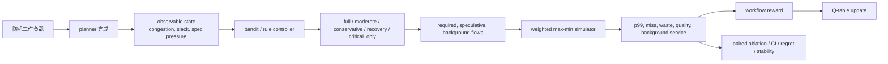
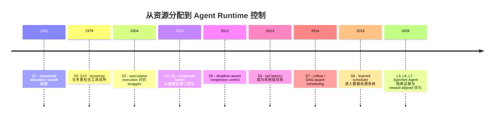
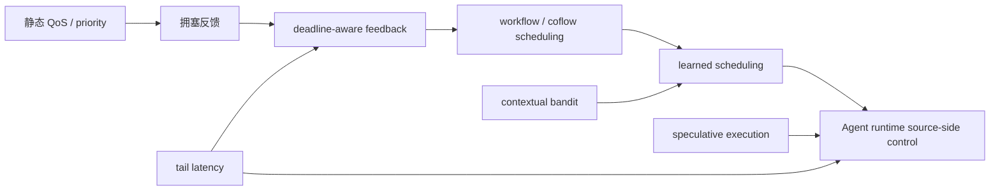
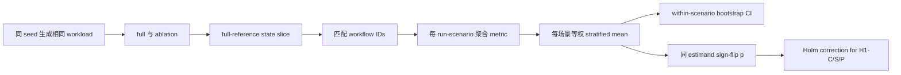

# SpecNet-Agent `specnet_proofs` 深度研究指南

> 更新：2026-07-19。本文是对代码、实验产物、原始设计文档和相关研究谱系的联合审计。它不是把 smoke 结果包装成论文结论，也不是把目录名里的 `proof` 误读成形式化定理证明。

## 一句话地图

这个目录验证的是一个系统研究假设：在 agentic GenAI 工作流中，网络流量有一部分来自可取消、可降级的 speculative branches；如果 runtime 在生成这些流量之前读取 congestion、effective slack 和 speculative pressure，就可能在 latency、deadline、waste 和质量之间做出更好的控制决定。

`specnet_proofs` 的“证明”是**可复现、可证伪的仿真实证证据链**：



最重要的结论不是“bandit 赢了”，而是：

- `congestion` 在 high-congestion slice 对 p99 latency 的必要性得到 full 证据支持。
- `slack` 在 tight-slack slice 对 deadline-normalized latency 的必要性得到支持，但 full 用更低 quality 换取更低 latency，存在清楚的 tradeoff。
- `spec_pressure` 的预注册主指标是 waste；去掉它反而减少 waste，同时 quality 下降、latency 上升，因此 H1-P 当前不支持。这个结果不能简化成“spec_pressure 没用”。
- bandit 可以被导出和复查，但 10 个训练 seed 的 action agreement 平均只有 0.407，27 个状态全部被标为 uncertain；不能声称策略表跨 seed 稳定或近似单调。
- 新增的 `aligned_scheduled` 优化把训练目标对齐到 quality floor、tail excess 和 background floor。在 full v3 中，它的 fair cost 比 baseline 低 1.4068，quality 高 0.0173，background service 高 0.0076，但 waste 高 3.242，p99 的差异不显著。这是一个 quality/fairness-first operating point，不是低延迟全面替代。

## 读前定位

### 这是什么类型的研究

它是一个小型、trace-driven、single-bottleneck 的控制器实验。每个 workflow 被抽象成 planner、required branches、LLM、judge、optional speculative branches 和 background flows；所有 flow 共享一个容量有限的链路。控制器在 planner 完成后只做一次 runtime action 决策。

它不是：

- 真实网络中的 packet-level implementation；
- 真实 LLM 答案正确率实验；
- 对所有可能规则的穷尽证明；
- 带共享 safety guard 的公平部署评估；
- 已发表、经同行评审的 SpecNet-Agent 外部复现实验。

### “proof” 到底是什么意思

这里的 proof 是 evidence harness：将假设、状态覆盖、消融切片、匹配 seed、统计检验、Q-table 审计和 verdict 自动化。它能回答“在这个 simulator、这个 reward、这个 workload matrix 和这个统计协议下，证据是否支持主张”，但不能把仿真结果升级为数学定理。

## 证据账本

### 本地项目来源

| ID | 来源 | 角色 | 可以支持什么 | 不能支持什么 |
|---|---|---|---|---|
| L1 | `科研/SpecNet-Agent_三项证明设计与意见.md` | 预注册式设计 | RQ1/RQ2/RQ3 的问题、切片、门槛和预期失败模式 | 不能证明结果已经实现 |
| L2 | `科研/SpecNet_Agent__...-3.extracted.txt` | 论文草稿抽取 | 原始 workload abstraction、QoS 论点、已有 baseline 与引用 | 论文草稿中的“real-world logs”不能自动变成当前 harness 的事实 |
| L3 | `specnet_proofs/proof_harness.py` | 可执行协议 | state、action、reward、训练、统计和输出 schema | 不能证明上游模拟器在任意机器都存在 |
| L4 | `specnet_proofs/test_proof_harness.py` | 单元测试 | 关键函数的局部不变量 | 不能证明仿真生态有效性 |
| L5 | `organized_code_files/.../specnet_agent_experiment.py` | 只读上游 simulator | flow 生成、队列分配、质量 proxy、reward 原语 | 不能证明改写后的 effective slack 与真实系统相同 |
| L6 | `results/proof_full_v2_20260719/PROOF_REPORT.md` | full v2 输出 | 20 paired seeds、10 stability seeds 的具体结果 | 不能代表之后修改代码的结果 |
| L7 | `results/optimization_full_v3_20260719/OPTIMIZATION_REPORT.md` | full 优化输出 | reward-aligned 候选的 tradeoff | 不能证明它在真实语义质量或真实网络上有效 |

### 外部基础来源

| ID | 来源 | 年份 | 为什么与本目录有关 |
|---|---|---:|---|
| S1 | Herbert Robbins, “Some Aspects of the Sequential Design of Experiments”, *Bulletin of the AMS*, DOI [10.1090/S0002-9904-1952-09620-8](https://doi.org/10.1090/S0002-9904-1952-09620-8) | 1952 | sequential allocation 与 bandit 问题的早期数学根源。Crossref 记录题名、作者、页码 527-535。 |
| S2 | Li, Chu, Langford, Schapire, “A Contextual-Bandit Approach to Personalized News Article Recommendation”, WWW, DOI [10.1145/1772690.1772758](https://doi.org/10.1145/1772690.1772758) | 2010 | context -> action -> one observed reward 的工程化范式；与本项目的 tabular contextual bandit 最接近。 |
| S3 | Dean and Ghemawat, “MapReduce: Simplified Data Processing on Large Clusters”, OSDI 2004, [USENIX paper](https://www.usenix.org/legacy/events/osdi04/tech/full_papers/dean/dean.pdf) | 2004 | speculative execution 的系统祖先：慢任务可复制以减轻 straggler 对 job completion 的影响。 |
| S4 | Alizadeh et al., “Data Center TCP (DCTCP)”, SIGCOMM, DOI [10.1145/1851182.1851192](https://doi.org/10.1145/1851182.1851192) | 2010 | 说明网络可通过显式拥塞反馈控制队列，而不是只靠静态优先级。 |
| S5 | Vamanan, Hasan, Vijaykumar, “Deadline-aware Datacenter TCP (D2TCP)”, DOI [10.1145/2377677.2377765](https://doi.org/10.1145/2377677.2377765) | 2012 | 将 deadline urgency 纳入 datacenter congestion control 的代表工作。 |
| S6 | Dean and Barroso, “The Tail at Scale”, *Communications of the ACM*, DOI [10.1145/2408776.2408794](https://doi.org/10.1145/2408776.2408794) | 2013 | 解释为什么 p99 尾延迟不能被 mean latency 代替。Crossref 记录该文为 CACM 56(2), 74-80。 |
| S7 | Chowdhury, Zhong, Stoica, “Efficient Coflow Scheduling with Varys”, SIGCOMM, DOI [10.1145/2619239.2626315](https://doi.org/10.1145/2619239.2626315) | 2014 | 将 DAG/coflow 的完成时间与网络调度联系起来；帮助区分 workflow-level 与 flow-level 控制。 |
| S8 | Mao et al., “Learning Scheduling Algorithms for Data Processing Clusters”, SIGCOMM, DOI [10.1145/3341302.3342080](https://doi.org/10.1145/3341302.3342080) | 2019 | learned scheduler 的系统谱系；提醒我们“学到的策略”必须和强规则 baseline 比。 |
| S9 | Bradley Efron, “Bootstrap Methods: Another Look at the Jackknife”, *Annals of Statistics*, DOI [10.1214/aos/1176344552](https://doi.org/10.1214/aos/1176344552) | 1979 | bootstrap CI 的经典来源；本项目使用 percentile bootstrap 的工程实现。 |
| S10 | Holm, “A Simple Sequentially Rejective Multiple Test Procedure”, *Scandinavian Journal of Statistics* 6(2), JSTOR [4615733](https://www.jstor.org/stable/4615733) | 1979 | Holm step-down correction 控制多个主假设的 family-wise error rate。 |
| S11 | Schuirmann, “A Comparison of the Two One-Sided Tests Procedure and the Power Approach for Assessing Equivalence...”, DOI [10.1007/BF01068419](https://doi.org/10.1007/BF01068419) | 1987 | practical equivalence 的背景来源；本 harness 用 CI 落在预设 margin 内的简化判据，不应冒充完整 TOST。 |
| S12 | Sutton and Barto, *Reinforcement Learning: An Introduction*, 2nd ed., [open book site](http://incompleteideas.net/book/the-book-2nd.html) | 2018 | state/action/reward、exploration/exploitation 和 tabular learning 的教材背景。 |

S1-S8 是概念谱系，不是声称这些论文直接引用或设计了 SpecNet-Agent。L1-L7 是项目事实；S1-S12 是外部术语和方法背景。两类证据不应混写。

## 故事版历史脉络

### 1. 最早的张力：每次尝试都要付成本

Robbins 的 sequential design 把问题说得很朴素：你有多个选择，每次试一个，观察结果，再决定下一次把机会给谁。探索能发现更好的选择，但也会浪费试验预算。今天的 bandit 仍然在解决这笔账，只是“奖品”换成了 latency、quality 或 reward。

### 2. 系统把“等待”变成完成时间

MapReduce 的 speculative execution 复制慢 task；它的直觉是，少量重复工作可能换来更早的整体 job completion。这个直觉在 agentic workflow 中变得更细：optional retrieval、debate branch 或额外 tool call 可能提升答案，但也会占用同一条瓶颈链路。于是“推测”不再只是复制慢 task，而是 runtime 主动创造的可削减 offered load。

### 3. 网络研究把反馈放进控制回路

DCTCP 代表一条路线：通过拥塞信号让发送方知道队列正在变坏；D2TCP 再把 deadline urgency 纳入控制。The Tail at Scale 则解释了为什么系统不能只看平均值：并行请求只要有一条慢尾，用户就会感到整个 workflow 慢。SpecNet-Agent 借用这两条思想，把 congestion 和 deadline slack 反馈到 agent runtime，而不是等流量生成后再排队。

### 4. 从 flow 到 workflow

Varys 等 coflow/workflow 调度工作说明，单个 flow 的优先级不足以表达 DAG 的依赖和整体完成时间。对 agentic workflow 来说，同一个 retrieval service 在一个 coding agent 中可能是关键流，在另一个 debate branch 中可能是可选流；关键性来自 dependency、deadline、branch utility，而不是 service type 本身。

### 5. 从手写规则到 learned scheduler

Decima 等 learned scheduling 工作说明，复杂状态空间中可以用学习器拟合调度决策，但也带来新问题：策略是否稳定？训练 reward 是否与部署目标一致？低支持状态会不会被 tie-break 伪装成“学到的动作”？`specnet_proofs` 的 RQ2 和 RQ3 正是在追问这些问题。



### 方法流派图



边表示“概念上解决了前一层暴露的瓶颈”，不是逐篇 citation claim。要做正式 citation lineage，应再查每篇论文的 reference/citation graph。

## 从代码还原一次 workflow

1. `generate_workload()` 用 exponential inter-arrival 加 burst probability 产生到达时间，再从四种 template (`rag_qa`, `coding`, `research`, `debate`) 生成 required/optional branches。
2. workflow 先进入 `planner`，planner flow 完成后才调用 `decide_action()`。因此 action 不是每个网络 epoch 都更新，而是每个 workflow 一次。
3. `ProofSimulator.observable_state()` 读取三个 bucket：`congestion_level()`、`workflow_slack_bucket()`、`speculative_pressure_bucket()`。
4. action 决定 branch_count、background scale 和 quality proxy。`critical_only` 只保留 required branches，`full` 允许最大 fanout。
5. 所有 active flows 共享链路容量；`serve_active_flows()` 用 weighted max-min 风格分配，critical control/bulk 的 weight 高于 speculative/background。
6. 所有 required flows 完成后才创建 LLM 和 judge。workflow 完成时，未完成 speculative/background flow 被取消；已发送的 speculative bytes 记作 waste。
7. `on_workflow_complete()` 读取 reward，按常数 learning rate 更新对应 state-action 的 Q 值。没有 discount，也没有跨 workflow transition，因此它是 contextual bandit，而不是完整 MDP Q-learning。

### 三个状态变量的真正实现

```text
state = (c, s, p)
c = active_remaining_bytes / (capacity * 12 epochs) -> low / medium / high
s = (deadline_time - now - T_remaining_hat) / T_remaining_hat
    -> tight (<0.25), normal (<1.0), loose
p = active_speculative_bytes / all_active_bytes
    -> low_spec (<0.15), mid_spec (<0.35), high_spec
```

`T_remaining_hat` 是 action-independent 的估计：template prior + required/LLM/judge serialization + active critical contention。它没有使用 future completion time 或 selected action，避免明显的 label leakage。

注意 `spec_pressure` 测的是决策时**系统已有 active traffic 中 speculative bytes 的占比**，不是这个 workflow 自己“可削减的 optional demand”占比。这是 H1-P 解释边界的核心。

### action 不是强弱完全有序的自然语言

代码中的 action name 由历史版本决定，实际配置还要看 `ACTION_CONFIG`：

| action | fanout | extra branches | background | quality floor | 直观画面 |
|---|---:|---:|---|---:|---|
| `full` | 1.00 | 99（受 template max 限制） | 100% | 1.00 | 城市畅通，几乎全开 |
| `recovery` | 0.85 | 6 | 100% | 0.98 | 拥塞刚退，逐步恢复 |
| `moderate` | 0.70 | 4 | 65% | 0.94 | 保留主路，关闭部分支路 |
| `conservative` | 0.45 | 2 | 30% | 0.86 | 只留较有把握的支路 |
| `critical_only` | 0.00 | 0 | 0% | 0.76 | 只送必经道路 |

`ACTION_STRENGTH` 明确了从 `critical_only` 到 `full` 的生成强度排序，但 `ACTIONS` tuple 的存储顺序不是这个排序；tie-break 不能被解释成语义上的偏好。

## RQ1：状态变量必要性

### 统计对象是什么

`n=533` 不是 533 个独立 workflow。代码在每个 `(run, scenario)` 单元中先聚合目标 slice 的 workflows，再计算 p99、miss、waste、quality 和 normalized latency；因此一个 paired unit 是一个 run-scenario slice。场景内 workflow 只是构造该单元的原始记录。

统计流水线是：



场景等权的含义是：一个 scenario 有 30 个 workflow、另一个有 100 个 workflow 时，先各自求 mean，再各占一半；不能让 workflow 多的场景偷走结论的权重。

### full v2 结果

| 假设 | 主指标 | ablation - full | 95% CI | Holm p | 判定 | 应该怎样读 |
|---|---|---:|---|---:|---|---|
| H1-C | high congestion p99 | +18.8423 | [10.5700, 26.8353] | 0.0032 | 支持 | 去掉 congestion 后尾延迟上升；waste/quality 同时下降，说明 full 保留了更多可用质量 |
| H1-S | tight slack normalized latency | +0.5241 | [0.4792, 0.5692] | 0.00015 | 支持但有 tradeoff | 去掉 slack 后 miss、waste、latency 大幅上升，quality 也高 +0.1541；full 是主动用质量换时限 |
| H1-P | high spec pressure waste | -3.0064 | [-4.2120, -1.8489] | 0.0008 | 不支持 | 去掉 pressure 的确少浪费，但 quality -0.0074、p99 +70.35、miss +0.0783；预注册的“waste 应变差”没有发生 |

### 这三个结果真正告诉我们的机制

**H1-C**：congestion 是“是否该收紧”信号。`no_congestion` 仍可能通过别的状态做出合理动作，所以 deadline miss 不显著变化；它最清楚的失败模式是 high-congestion p99。

**H1-S**：slack 是“现在能不能等”信号。没有它，控制器无法区分宽裕 workflow 和迫近 deadline 的 workflow；结果是更大的 fanout、更多 waste 和更高 miss。由于 optional branches 也带来 quality，full 的低 quality 不是 bug，而是 tradeoff，除非论文声称零质量损失。

**H1-P**：当前 pressure 定义和主指标不匹配。去掉 pressure 后，策略减少 speculative bytes，恰好把 waste 降低，但付出 latency 和 quality 代价。这说明 pressure 可能在控制 latency-quality operating point 上有信息，但**没有证明它是 waste 最小化的必要变量**。下一版应测试 `current speculative backlog`、`workflow optional-byte ratio`、`cancelable queue length` 等候选，并把 quality-constrained cost 设为主指标。

## RQ2：tuned rule 与 bandit

### 比较协议

rule 使用与 bandit 相同的三个 state input、五个 actions 和 risk score：

```text
risk = wc*c + ws*s + wp*p + wcs*c*s + wcp*c*p
```

96 个候选只在 validation matrix 搜索，阈值必须满足 `t0 < t1 < t2 < t3`；test 阶段冻结。quality floor 有两种：`bandit_validation_quality - 0.01 = 0.9302` 和固定 `0.95`。

### full v2 读法

| policy | mean p99 | miss | waste | quality | mean domain regret |
|---|---:|---:|---:|---:|---:|
| bandit | 103.747 | 0.0181 | 45.183 | 0.9393 | 2.5047 |
| global tuned rule | 95.874 | 0.0217 | 44.436 | 0.9410 | 1.0240 |
| fixed moderate | 107.436 | 0.0352 | 38.713 | 0.9418 | **0.0186** |
| global q95 rule | 124.804 | 0.0514 | 53.930 | 0.9835 | 0.5430 |
| handwritten rule | 72.616 | 0.0087 | 21.532 | 0.8607 | 6.3951 |
| per-template rule | 112.793 | 0.0359 | 51.629 | 0.9734 | 0.6569 |

`fixed_moderate` 的低 regret 是警报：在当前 scalar cost 中，简单固定动作已经接近每个 domain 的最好部署点；bandit 没有被四目标严格全面支配，但它在“每 workflow reward”上学习到的表格并没有转化为这套跨域 cost 的优势。

因此正确结论是：

- 可以说“有限搜索的 global rule 没有跨环境稳定四目标支配 bandit”；full 的 raw dominance 计数是 rule=1、bandit=0、neither=279。
- 不能说“任何 rule 都不能替代 bandit”；`fixed_moderate` 的 scalar regret 更低，必须作为强 baseline。
- `handwritten_rule` 的极低 latency 伴随 quality=0.8607，违反匹配 quality floor；不能把它当作有效胜者。
- tuned rule 的 per-load/per-template 版本是更乐观的人工重调上界，不是公平的单一可部署 rule。

## RQ3：可审计不等于稳定

full v2 的 Q-table：27/27 状态 seen，22/27 达到 N>=30；5 个低支持状态只能描述，不能做强解释。每个状态导出五个 Q 值、五个 update count、best/second action、Q margin、test count、guard path。

审计结果：

- mean action agreement = 0.407；27/27 uncertain；
- `counterfactual_audit.csv` 对 supported states 做单变量切换，action flip rate 约为 congestion 0.773、slack 0.750、spec_pressure 0.818；这证明表格对变量敏感，但不是因果实验；
- `sanity_checks.csv` 有 4 个 supported checks，其中 3 个 violation；不能声称 learned policy 近似单调；
- `policy_stability_equivalence.csv` 的 4/4 held-out performance metrics 都没有落入预设 equivalence margin，支持“不稳定”诊断，但该诊断仍依赖 10 个训练 seed 和 12 个 evaluation scenario。

### 四层解释性

| 层 | 问题 | 当前证据 | 结论 |
|---|---|---|---|
| Transparency | 能否打印和复算动作？ | Q table、counts、raw/guarded action 导出 | 支持 |
| Support | 这个状态是否有足够样本？ | 22/27 N>=30 | 部分支持 |
| Counterfactual faithfulness | 改一个变量，表格动作会不会变？ | flip audit | 支持敏感性，不是因果 |
| Stability | 换训练 seed 仍是同一策略吗？ | agreement 0.407，全部 uncertain | 不支持 |

## full v3：实际做过的优化与结果

优化 study 不改写 proof v2 的 claim，而是单独比较：

1. `scheduled`：epsilon 0.18 -> 0.03，learning rate 0.25 -> 0.05；
2. `fair_scheduled`：background 低于 20% 才惩罚，避免“服务越多 reward 越差”；
3. `scheduled_ensemble`：三个独立 Q-table 按 state-action 取 median；
4. `confidence_hybrid_m002/m005`：N<30 或 Q margin 低时回退到 validation-frozen quality>=0.95 rule；
5. `fixed_moderate`、`validation_rule`：不学习的强 baseline；
6. `aligned_scheduled`：reward 额外惩罚 tail excess、quality floor shortfall 和 background shortfall。

### aligned_scheduled 的 full 证据

| 指标 | aligned - baseline | 95% CI | 解释 |
|---|---:|---|---|
| p99 latency | +2.0704 | [-3.8002, 7.7843] | 平均略慢，但差异不显著 |
| deadline miss | +0.0002 | [-0.0107, 0.0116] | 没有可靠变化 |
| waste | +3.2424 | [1.1681, 5.4819] | 显著增加，代价明确 |
| quality | +0.0173 | [0.0115, 0.0235] | 显著提高 retained-speculation proxy |
| background service | +0.0076 | [0.0048, 0.0103] | 显著提高后台服务 |
| fair cost | -1.4068 | [-1.8214, -0.9891] | 在含质量/后台约束的 scalar cost 下显著降低 |

所以它适合这样的论文句子：

> Reward alignment moves the controller toward a quality- and service-preserving operating point: it raises the retained-speculation proxy and background service while reducing the quality-constrained scalar cost, at the expense of additional speculative bytes. It does not establish a p99-latency improvement.

不适合这样的句子：

> The optimized controller improves every QoS metric.

## 复现与协议审计

### 已修复

- 默认上游路径优先寻找仓库内 `organized_code_files/source_snapshot/.../specnet_agent_experiment.py`，找不到才回退旧服务器绝对路径。
- manifest 记录 `protocol_version`、harness SHA-256、upstream SHA-256、stage、matrix、guard 设置。
- RQ1 CI、effect size 和 sign-flip p-value 使用同一个 scenario-stratified estimand。
- RQ2 增加 `policy_bandit_pairwise.csv`、`policy_bandit_pairwise_summary.csv` 和 `deployment_policy_summary.csv`，不再只比较 global rule。
- 单元测试从 8 个增加到 14 个，覆盖场景等权随机化、所有部署 baseline 配对、公平 reward、aligned reward、median ensemble 和 confidence fallback。

### 仍需注意

- `results/full` 是旧协议产物：缺少新版 pairwise、equivalence 和 deployment summary；正式引用应使用 `results/proof_full_v2_20260719`。
- 默认 `guard` 仍对所有 policy 关闭，这是 controller-core comparison，不是 safety-guarded deployment 证明。
- simulator 的 `quality` 由 branch count 和 action floor 的公式计算，是 retained-speculation proxy，不是 human/LLM judge correctness。
- `background` 在原始 reward 中曾作为已服务 bytes 的成本项；aligned v3 只在优化 study 中修正，未悄悄改写 proof v2 的历史含义。
- 测试通过不等于结果可外推到真实 topology、multi-tenant fairness、semantic quality 或 noisy hints。

### 正确运行方式

```bash
cd /home/student15267/Cryptotest/科研/organized_code_files/student15267
python -m unittest specnet_proofs.test_proof_harness \
  specnet_proofs.test_optimization_study -v

python -m specnet_proofs.proof_harness --mode smoke \
  --output-dir specnet_proofs/results/proof_smoke_v2_20260719
python -m specnet_proofs.proof_harness --mode full \
  --output-dir specnet_proofs/results/proof_full_v2_20260719

python -m specnet_proofs.optimization_study --mode smoke \
  --output-dir specnet_proofs/results/optimization_smoke_v3_20260719
python -m specnet_proofs.optimization_study --mode full \
  --output-dir specnet_proofs/results/optimization_full_v3_20260719
```

## 专有名词百科：先用生活画面，再回到代码

下面的解释覆盖当前目录 README、代码、CSV、报告和优化 study 中的主要专业词。每一条都回答四个问题：它在学术上是什么、像生活中的什么、在本项目哪里出现、最容易错在哪里。

### A. 项目与系统

| 术语 | 正式义 | 生动画面 | 本项目落点 | 常见误解 |
|---|---|---|---|---|
| SpecNet-Agent | network-aware speculation control 的项目名 | 交通灯读到拥堵后，先叫停可选支路 | `SpecNet-Agent`、`specnet_agent_experiment.py` | 不是一种标准网络协议，也不是已证实的通用模型 |
| agentic GenAI | 会规划、调用工具、检索、并行分支的生成式 AI 服务 | 一个会自己分工的项目组 | workflow templates 与 branch flows | 不等于“用了一个 LLM” |
| runtime | 执行 workflow 的程序层 | 项目经理决定下一步叫谁 | `spawn_branches()` 前的 action 决策点 | 不等于 kernel 或交换机 |
| workflow | 有依赖、有 deadline 的一次 agent 任务 | 一张从需求到答案的施工流程 | `WorkflowSpec` / `WorkflowRuntime` | 不是一个单独 network packet |
| DAG | directed acyclic graph，有方向且无环的依赖图 | 工序只能向前，不能绕回已经完成的工序 | 论文模型中的 workflow dependency；代码用 stage/flow 列表近似 | 图有分支不代表一定显式存成 DAG |
| stage | workflow 所处的执行阶段 | planner、branches、LLM、judge 四个工位 | `WorkflowRuntime.stage` | stage 不是 network layer |
| flow | 一段服务请求对应的可传输工作 | 从仓库运往工地的一车货 | `Flow`，有 size、remaining、role | flow 不是一定等于 TCP flow |
| trace-driven | 用记录或生成的事件轨迹驱动模拟 | 按旧监控录像重放交通 | 当前是随机生成 workload 的 trace-like replay | 不是生产线上直接测量 |
| simulator | 按规则推进时间和流量的模型 | 纸上交通沙盘 | `ProofSimulator` / upstream `Simulator` | simulator 内的 throughput 不自动等于真实网络吞吐 |
| replay | 在相同 seed/workload 上重放不同策略 | 同一场考试换不同答题法 | `run_once()` 与 paired evaluation | paired 不会自动消除所有模型偏差 |
| QoS | quality of service，服务质量目标集合 | 快、准、别迟到、别饿死后台 | p99、miss、waste、quality、background | QoS 不只等于 latency |
| SLO | service-level objective，可验收的服务目标 | “95% 请求在 200ms 内完成” | quality floor、deadline 等可作 SLO-like 约束 | 当前没有真实线上 SLO contract |
| controller | 根据状态选 action 的决策器 | 交通控制中心 | bandit、tuned rule、hybrid | controller 不等于 scheduler；前者决定是否生成，后者分配已生成流量 |
| policy | 状态到 action 的函数 | 看到天气就决定是否出门 | `AuditedBandit`、`FixedActionPolicy` | policy 不是只指神经网络 |
| baseline | 用来比较的参照策略 | 实验组旁边的标准尺 | FIFO、fixed moderate、handwritten rule、bandit | baseline 越简单不代表越弱；fixed moderate 是强 baseline |

### B. workflow、网络和流量

| 术语 | 正式义 | 生动画面 | 本项目落点 | 常见误解 |
|---|---|---|---|---|
| critical path | 决定 workflow 完成时间的依赖链 | 任何一段堵住，整条施工就不能交付 | required branch -> LLM -> judge | critical 不等于字节最多 |
| critical control | 关键的小控制消息 | 项目经理的确认电话 | planner/judge 等小流的 role | 不是所有 control packet 都 critical |
| critical bulk | 关键的大数据流 | 必须到场的主材料 | required branch 或 LLM 大流 | bulk 只说明大小，不说明可选性 |
| required branch | 任务必须完成的分支 | 主干工序 | `BranchSpec.required=True` | required 也可能因拥塞而 deadline miss |
| optional branch | 可省略但可能提升质量的分支 | 备用设计稿 | `required=False` 的 branch | optional 不等于无价值 |
| speculative branch | 为潜在收益提前发出的可取消分支 | 还不知道用不用就先叫的备选队 | `speculative=True`、waste 统计 | 不是随机猜测；它有 workflow hint 和 utility 语境 |
| background flow | 不阻塞当前答案的同步/维护流 | 工地收拾材料、同步档案 | `background=True` | background 不等于永远可以饿死 |
| fanout | 一个 workflow 启动的并行分支数 | 一个任务同时叫几支施工队 | `branch_count_for_action()` | fanout 越大不必然越快，可能争抢瓶颈 |
| offered load | 系统主动送入网络的工作量 | 往单车道上不断加车 | branch/background 创建量 | 不等于 link utilization；有些流可能还没被服务 |
| bottleneck | 限制整体速度的最窄资源 | 一座桥卡住全城 | `capacity` 共享链路 | bottleneck 不是一定在网络，模型里被固定为链路 |
| capacity | 单个时间 epoch 可服务的字节量 | 每分钟最多放行多少车 | `LOAD_CONFIG[load]["capacity"]` | capacity scale 是实验旋钮，不是物理测量 |
| queue pressure | 活跃剩余工作量相对容量的压力 | 桥前排了多少车 | `remaining_active_bytes / capacity` 的采样 | pressure 不是拥塞控制协议本身 |
| congestion | 当前网络资源争抢程度 | 道路是否堵 | active bytes / capacity horizon 的 bucket | 代码的 ratio 是近似压力，不是 ECN 的真实 mark |
| congestion bucket | 把连续压力离散成 low/medium/high | 轻微拥堵、拥堵、严重拥堵三档 | `congestion_level()` | bucket 边界改变会改变研究问题 |
| queue mapping | 按 flow role 把流放入不同优先级 | 救护车走专用车道 | `flow_weight()` 的角色权重近似 | 它只安排已有流，不能减少源端 offered load |
| weighted max-min | 在权重约束下尽量公平地分剩余容量 | 有优先证件的车多拿一些通行额度，但不是无限独占 | `serve_active_flows()` | 当前实现是风格近似，不是完整 max-min fairness theorem |
| serialization | 发送一批字节所需的容量时间 | 一箱货逐件过门 | `own_bytes / capacity` | 不含所有 future arrival |
| contention | 其他活跃流造成的竞争时间 | 前面还有别的车 | `all_active / capacity` 项 | 不等于 queueing delay 的精确闭式公式 |
| RTT | round-trip time，往返时延 | 传话后等回信 | 外部网络术语，当前 simulator 未逐包模拟 | 论文提到 telemetry 不等于本代码采集 RTT |
| ECN | explicit congestion notification，用标记反馈拥塞 | 桥管理员举“请减速”牌 | S4 的网络背景 | 当前 harness 没实现 ECN |
| DSCP | IP header 中用于服务分类的字段 | 货物上的优先标签 | 论文部署路线背景 | 当前代码只用 role weight 模拟 |
| coflow | 一组相关 flow 必须共同完成的通信集合 | 一批材料必须一起到工地 | S7 的研究对象，workflow 是更动态的近邻 | coflow 不自动等于 agent workflow |
| straggler | 比其他并行任务慢的执行单元 | 一名落后的队员拖慢全队 | S3 的 speculative execution 背景 | 当前代码没有复制一个已慢 task，而是提前生成 optional branch |
| source-side control | 在流量生成前调整请求宽度/并发 | 车还没上路就决定少派几辆 | action 改 branch fanout/background scale | 不等于交换机端 queue scheduling |
| retrieval top-k | 检索返回前 k 个候选 | 从图书馆先拿几本书 | 论文 action abstraction；当前 simulator 用 branch count 近似 | top-k 不等于 quality correctness |
| parallel agents | 并发调用的 agent 数 | 同时请几位顾问 | 论文 action abstraction | 当前 proof harness 没有独立 agents 字段 |
| speculation budget | 允许投机分支消耗的预算 | 给备用方案的限额 | 论文概念；代码通过 fanout/background scale 近似 | 不等于 GPU token budget |
| branch cancellation | 任务确定后取消未完成 optional flow | 选定主方案后叫停备用队 | `finish_workflow()` | 已发送的 bytes 不能追回，仍计 waste |

### C. deadline、slack、quality 和指标

| 术语 | 正式义 | 生动画面 | 本项目落点 | 常见误解 |
|---|---|---|---|---|
| deadline | workflow 可接受的完成时限 | 截止交付时间 | `WorkflowSpec.deadline` | 不是 network packet TTL |
| deadline miss | latency 超过 deadline 的事件 | 交作业迟到 | `deadline_miss=1` | miss ratio 与 p99 是不同指标 |
| remaining budget | 当前时刻到 deadline 的剩余时间 | 离截稿还剩几小时 | `workflow.deadline_time - sim.time` | 它不扣除剩余工作量 |
| slack | deadline 留出的可等待余量 | 截稿前还有多少缓冲 | `workflow_slack_ratio()` / effective bucket | 只用 `(deadline-now)/deadline` 会把 work size 忽略掉 |
| effective slack | 剩余预算减去预测的剩余 critical time | 先估还要施工多久，再看还能喘几口气 | `ProofSimulator.workflow_slack_ratio()` | 估计器必须与 action 独立，否则是信息泄漏 |
| slack margin | `(remaining budget - estimate)/estimate` | 缓冲是剩余工程时间的几倍 | tight<0.25, normal<1, loose | 阈值是协议选择，不是自然常数 |
| template prior | 根据 workflow template 给的剩余时间先验 | 经验上 debate 比 retrieval 需要不同准备时间 | `0.22 * deadline_base` | prior 不是看到未来完成时间 |
| normalized latency | latency / deadline | 100ms 迟到对 1s deadline 和 10s deadline 不同 | RQ1 H1-S 主指标 | 归一化不等于消除所有 template 差异 |
| p95 | 95th percentile | 100 次里最慢的 5% 的边界 | upstream summary 也导出 | 不是平均尾部 |
| p99 | 99th percentile，尾延迟 | 1000 次里最慢的约 10 次边界 | RQ1/RQ2 主尾指标 | p99 对样本量和 percentile interpolation 敏感 |
| percentile interpolation | 在排序样本间按位置插值 | 两个刻度之间估读 | `up.percentile()` | 样本少时 p99 不是一个真实单点观测 |
| waste | 已服务但最终不影响完成答案的 speculative bytes | 备用车已开到半路才取消 | `wasted_speculative_bytes` | waste 低可能只是少做 speculative work，不一定更好 |
| quality | 本实验的 retained-speculation proxy | 备用方案保留得多不多 | `quality_for_action()` 的 branch-count 公式 | 不是语义正确率、用户满意度或 judge accuracy |
| quality floor | 可接受的最低质量门槛 | 不能低于及格线 | RQ2 0.95 或 bandit-0.01 | soft penalty 不等于硬约束；要看 feasible flag |
| background service ratio | background 已服务 bytes / 原始 background bytes | 档案同步完成了多少 | v3 optimization metric | 不是 fairness index |
| link utilization | 实际 served / 可用 capacity | 道路实际通行量 / 最大通行量 | upstream summary | 高 utilization 不一定低 latency |
| action strength | 对 speculative fanout 的相对强度排序 | 从只保主路到全线放行 | `ACTION_STRENGTH` | action name 的字面顺序不是 strength |
| operating point | 多目标权衡曲线上的一个具体策略配置 | 同一辆车的“省油/快到/舒适”档位 | aligned_scheduled 是 quality-first point | 一个 point 不能代表整个 Pareto frontier |

### D. bandit 与学习术语

| 术语 | 正式义 | 生动画面 | 本项目落点 | 常见误解 |
|---|---|---|---|---|
| multi-armed bandit | 每轮选一个 arm，只看到被选 arm 的 reward | 多台老虎机，每次只能拉一台 | bandit 的历史根源 | 不是普通 supervised classification |
| contextual bandit | 先观察 context，再选 action，只得到本轮结果 | 看天气后选交通方案，只知道实际方案效果 | state tuple 是 context，action 是 arm | 没有完整 future transition，所以不是 MDP |
| state | 控制器可见的环境摘要 | 仪表盘上三盏灯 | `(congestion, slack, spec_pressure)` | state 不是完整 simulator 内部真相 |
| discretization / bucket | 把连续值切成有限档 | 温度显示冷/暖/热 | low/medium/high 与 tight/normal/loose | bucket 边界会影响覆盖和结论 |
| action space | 控制器可以选择的动作集合 | 五个档位按钮 | `ACTIONS` 五项 | action space 固定不代表动作成本相同 |
| Q-value | 在某个 state 选某 action 的经验回报估计 | 记分牌上“这个档位过去平均得分” | `q_values[state][action]` | 这里不是带 discount 的 MDP Q-function |
| reward | 把一次 workflow 结果压成学习信号 | 裁判把速度、迟到、浪费、质量打成总分 | `workflow_reward()` | reward 不是论文最终指标；错配会导致 RQ2 失败 |
| learning rate | 新观测改变旧 Q 的幅度 | 新比赛成绩占总评分多大比例 | base .25，scheduled 退火到 .05 | 小 learning rate 不自动更稳定 |
| exploration | 试不确定动作以获取信息 | 偶尔走一条没走过的路 | epsilon-greedy | 探索不是随机越多越好 |
| exploitation | 选择当前 Q 最高动作 | 总走目前看起来最快的路 | evaluation mode epsilon=0 | 过早 exploitation 会锁在坏动作 |
| epsilon-greedy | 以 epsilon 随机探索，否则选当前最好 | 18% 抽签，82% 走记分最高路 | train epsilon=.18 | 代码没有 epsilon decay，直到 v3 optimization |
| episode | 一次完整训练仿真回合 | 一天的交通记录 | `train_bandit()` 的每个 workflow workload run | 不是一个单独 workflow |
| online update | 结果回来后立即更新 Q | 每次比赛后立刻改策略表 | `on_workflow_complete()` | 不代表 online deployment；test 中 Q 被冻结 |
| frozen policy | 训练结束后不再更新的策略 | 封存一份值班手册 | `set_evaluation_mode()` 和 checkpoint | frozen 仍可能在新 workload 上表现变差 |
| checkpoint | 可恢复的策略快照 | 保存游戏进度 | `full_bandit.json`、optimization reference JSON | checkpoint 只保存 table，不保存所有 simulator trace |
| Q margin | best Q 与 second-best Q 的差 | 第一名领先第二名多少分 | `q_margin` | margin 大不代表 Q 值正确，只表示表内更确定 |
| visit count | state 被遇到的次数 | 这个路口被观测了多少次 | `visit_count` | visits 少时默认 zero/tie-break 不能当知识 |
| update count | 某 state-action 真正更新的次数 | 某按钮被按过多少次并得到反馈 | `updates_*` | visit 与 action update 可能不同 |
| tie-break | Q 相等时的固定选择规则 | 平票时按名单顺序选人 | `max(..., -ACTIONS.index())` | tie-break 不是 learned preference |
| ensemble | 多个独立模型合并预测 | 三位独立裁判取中位意见 | `MedianEnsemble` | ensemble 不能补救错误 state definition |
| median ensemble | 对每个 state-action 取中位 Q | 一个极端裁判不至于带偏全票 | v3 optimization | 成本是额外训练和部署存储 |
| confidence fallback | 低支持/低 margin 时回退规则 | 经验不足就请有经验的人接管 | `ConfidenceHybrid` | fallback 稳定不等于性能更优 |
| scheduled learning | 随训练进度调整 epsilon/learning rate | 新手期多试，熟练后少试 | v3 `scheduled` | 需要独立 full test，smoke 只筛选 |
| reward alignment | 训练 reward 与部署选择目标使用同一价值方向 | 练习分数不再和考试评分相反 | v3 `AlignedRewardSimulator` | 对齐一个 scalar cost 仍不能覆盖所有 Pareto 目标 |

### E. 实验设计与可识别性

| 术语 | 正式义 | 生动画面 | 本项目落点 | 常见误解 |
|---|---|---|---|---|
| RQ | research question，研究问题 | 先问清到底要查什么 | RQ1 state、RQ2 rule、RQ3 audit/stability | RQ 不是结果 |
| H1 | hypothesis，预注册方向假设 | 先写“如果去掉信号，应在哪里变坏” | H1-C/S/P | p<.05 不足以替代方向条件 |
| ablation | 去掉一个组件观察特定失败模式 | 拆掉汽车的刹车看哪里出问题 | `NoCongestionBandit` 等 | 只跑一个 aggregate 点不是充分 ablation |
| independent training | 每个 ablation 从零训练自己的 Q table | 每队重新练，不借用冠军笔记 | `ABLATIONS` 各自 `train_bandit` | 复用 full Q 会混淆变量必要性与训练运气 |
| matched workflow pairing | 同 seed、同 workflow ID 对比 policy | 同一批病人接受两种治疗 | `full_reference` slice | matching 仍不能消除 policy 改变状态的内生性 |
| full-reference slice | 用 full policy 的状态锁定样本成员，再取 ablation 对应 workflow | 先按标准组挑病人，再看另一治疗 | `ablation_slice_rows()` | 若按 ablation 自己状态筛，会产生不同样本集偏差 |
| endogenous state | policy 可能改变自己看到的状态 | 司机减速后，路况也被自己改变 | ablation state buckets 可能不同 | 不控制会把“改变样本”误当“变量必要性” |
| scenario matrix | load、deadline scale、optional scale、capacity scale 的组合 | 同时改变天气、道路、截止时间做压力测试 | full 81 combinations | factorial matrix 不是现实分布的证明 |
| coverage gate | 状态被访问到的最低门槛 | 先确认每种路况都真的出现 | seen>=24/27 | seen gate 只保证出现，不保证 N>=30 解释可靠 |
| support threshold | 允许做主解释的最小访问次数 | 至少有 30 次观察再下结论 | N>=30 | 30 是协议门槛，不是普适统计定律 |
| smoke | 小预算 correctness/protocol run | 发车前绕场测试 | 36 train episodes, 2 eval runs | smoke 不用于显著性论文结论 |
| pilot | 用于发现 coverage/参数问题的中间实验 | 试搭一小段舞台 | `pilot162` | pilot 结果不应和 preregistered test 混写 |
| full | 主实验预算 | 正式演出 | 162 training episodes, 20 eval runs | full 仍是 simulator evidence |
| validation | 选择规则/超参数的集合 | 练习卷，允许调参 | candidate rule search | 看过 validation 就不能再叫 held-out test |
| test / held-out | 参数冻结后只评估 | 期末卷，不能回头改答案 | `rule_bandit_test.csv` | held-out seed 不等于真实生产分布 |
| preregistration | 在看 test 结果前冻结主指标和方向 | 先写评分规则再开考 | L1 的 H1 主指标 | 事后换指标会增加 researcher degrees of freedom |
| primary metric | 预先指定的主要判定指标 | 冠军唯一主赛道 | H1-C p99、H1-S normalized latency、H1-P waste | 其他指标仍须报告，不能隐藏 tradeoff |
| controller-core comparison | 所有 policy 统一关闭 guard 的比较 | 比发动机本体，不带不同安全装备 | manifest `guard=disabled_for_all_policies` | 不能写成 safety-guarded deployment result |
| protocol version | 代码、统计和输出 schema 的版本标签 | 比赛使用哪一版规则 | `2026-07-19.v2` / optimization-v3 | 结果目录名本身不是完整版本证明 |
| manifest | 记录输入、hash、预算、stage、矩阵的清单 | 实验封条和航海日志 | `run_manifest.json` | 有 manifest 不等于代码没有 bug |
| SHA-256 | 文件内容指纹 | 封存样品的唯一条码 | upstream/harness hash | hash 能证明同一文件，不能证明文件逻辑正确 |

### F. 统计与多目标

| 术语 | 正式义 | 生动画面 | 本项目落点 | 常见误解 |
|---|---|---|---|---|
| estimand | 你真正想估的量 | 先定义“平均哪一种平均” | equal-scenario mean delta | CI 方法必须匹配 estimand |
| statistical unit | 独立或被视为重复的分析单位 | 一次治疗，而不是治疗中的每个血压读数 | RQ1 是 run-scenario slice | workflow 数多不代表 n 可直接加大 |
| delta | ablation - full 或 rule - bandit 的差 | 新方案比旧方案多花/少花多少 | report 的 signed effect | 正负必须结合 metric 方向读 |
| stratification | 按固定场景分层再平均/抽样 | 每个城市先算，再给城市等权 | `stratified_mean`/CI | 不分层会让 workflow 多的场景支配结果 |
| bootstrap | 从已有样本有放回重抽，近似 sampling distribution | 从一袋已有球反复抓球 | `stratified_bootstrap_ci()` | bootstrap 不是生成新真实数据 |
| percentile CI | 直接取 bootstrap estimates 的 2.5/97.5% 分位数 | 重抽分布的两端刻度 | 当前实现 | 不是唯一 CI 构造法 |
| paired test | 同一 workload 的差值而不是两组独立均值 | 同一个人前后测量 | rule/full、ablation/full | pairing 不自动代表 causal identification |
| sign-flip randomization | 随机把 paired delta 乘 +/-1 构造零假设 | 抛硬币决定每场景谁算正谁算负 | `stratified_randomization_p()` | p 值仍依赖 exchangeability 假设 |
| p-value | 在零假设成立时看到至少如此极端结果的概率 | 假设没效果时，出现当前差距有多罕见 | primary p | 不是“主张为真的概率” |
| Holm correction | 按 p 从小到大逐步调整，控制 FWER | 三场比赛一起判，收紧最容易误报的门 | H1-C/S/P | 不是把每个 p 简单乘 3 |
| FWER | family-wise error rate，一组检验至少一次假阳性的概率 | 一串烟花里至少一朵误报 | Holm 的控制目标 | 不等于每个单项 p 的 false discovery rate |
| effect size | 把差异按变异程度标准化 | 差 10 分在满分 100 和波动 1/100 的意义不同 | scenario-level `paired dz` | effect size 大不代表部署价值大 |
| confidence interval | 对 estimand 不确定性的区间描述 | 测量尺的误差带 | 95% CI | CI 跨 0 不是“绝对没有效应” |
| statistical significance | 预设检验下证据足够偏离零 | 不是偶然噪声的证据 | p<.05 规则 | 显著不等于大、不等于实用 |
| practical significance | 是否达到业务可感知/可接受的幅度 | 省 1ms 但部署复杂十倍是否值得 | equivalence margins、quality floor | 需要先声明 margin |
| equivalence | 差异落在实际可接受区间 | 两把尺虽不完全相等，但误差内可互换 | `policy_stability_equivalence.csv` | 当前 CI-margin 规则是简化版，不是完整 TOST |
| TOST | two one-sided tests，分别检验不低于下限和不超过上限 | 证明差异既没太负也没太正 | S11 背景；当前代码未正式实现 | 不能把 CI inclusion 自动称为 TOST |
| Pareto frontier | 没有另一个方案在所有目标都不差且至少一项更好的点集 | 省油、快、舒适之间的不可同时超越档位 | `tuned_rule_pareto.csv` | frontier 不是单一冠军 |
| dominance | 一个方案各目标都不差且至少一项更好 | 同一辆车全指标都更省/更快 | RQ2 four-objective diagnostic | strict dominance 很苛刻，neither 很常见 |
| non-domination | 两个方案各有胜负，谁也不能全赢 | 一个快但费油，一个省油但慢 | full RQ2 279 neither | neither 不等于两者相同 |
| scalar cost | 将多目标用权重压成一个数 | 把速度、油耗、舒适折成总分 | `validation_objective`、`fair_cost` | 权重改变就可能改变 winner |
| normalization scale | 把不同量纲放到可加的尺度 | 秒和公斤先换成同类刻度 | median p99/waste scales | scale 只能来自 validation，不能看 test |
| regret | 相对该 domain 最好可部署策略的额外 cost | 同一赛道没拿到最佳档位多付的分 | `per_domain_regret.csv` | regret 的“最好”受候选池和 cost 定义限制 |
| quality-constrained winner | 先看是否过 quality floor，再比 cost/支配 | 先过及格线才有资格比快慢 | `constrained_winner` | raw dominance winner 可能是低质量假胜者 |
| finite search | 只在有限候选参数中找最优 | 从 96 张菜单里挑，不是发明所有菜单 | RQ2 96 candidates | 不能从有限搜索推出所有规则不可能 |

### G. 审计、解释与因果边界

| 术语 | 正式义 | 生动画面 | 本项目落点 | 常见误解 |
|---|---|---|---|---|
| auditability | 输入、状态、动作、reward、guard、结果可追查 | 账本能逐笔对上 | CSV、JSON、heatmap、manifest | auditability 不等于 correctness |
| transparency | 人能看到内部表和动作 | 打开值班手册 | q table export | 看得到不等于看得懂或可信 |
| interpretability | 能给出可理解的行为解释 | 说清为何此刻限流 | state/action/counterfactual | Q table 小不等于解释充分 |
| counterfactual audit | 改一个输入维度再看表格动作 | 只改天气，其余路况不动 | `counterfactual_audit.csv` | 它是 model inspection，不是重新跑真实世界的 causal effect |
| action agreement | 多 seed 在同一 state 选同一 action 的比例 | 多位教练给出同一战术的比例 | `policy_stability.csv` | agreement 低可能是近 tie，不必然性能低 |
| uncertain state | agreement 未达 0.8 的状态 | 教练意见分裂 | full 27/27 uncertain | uncertain 不是错误 state |
| sanity check | 预期趋势的快速一致性检查 | 拥堵变重不应建议放更多车 | 4 个 monotonicity checks | 违反 sanity 不自动证明 policy 错 |
| monotonicity | 某变量单调变化带来不变或单向 action strength | 拥堵越重不应越开放 | `ACTION_STRENGTH` 比较 | 多目标 reward 可能合法地打破简单单调 |
| guard | 在 policy action 外加硬约束 | 安全员可否决危险方案 | 当前 proof 全部 disabled | 仅有 quality rule 不等于共享 guard |
| information leakage | state 使用了未来结果或 action 结果 | 考试前偷看答案 | effective slack 明确不读 future completion | action-independent 仍不代表 state 足够好 |
| external validity | 结果能否推广到真实系统 | 沙盘规则能否用于真实城市 | 当前很弱 | 需要真实 traces/topologies/hints/semantic quality |
| internal validity | 在当前设定内因果比较是否干净 | 同一批人、同一条件只换治疗 | paired seeds、full-reference slice | 内部有效不等于外部可推广 |
| researcher degrees of freedom | 分析者事后可选择的切片、指标、规则 | 看完比赛再改计分板 | preregistration、frozen test 防范 | 多文件不自动减少自由度 |
| starvation | background 或低优先级流长期得不到服务 | 只让救护车过，清洁队永远进不来 | background service ratio、future guard requirement | 当前 proof 没有真正 fairness guarantee |

## 最值得精读的论文与文件

### S2 Contextual bandit (Li et al., 2010) - Start here

- **为什么读**：它最接近“观察 context，选择 action，得到一个结果”的工程 loop。
- **初学者摘要**：新闻推荐系统不能同时尝试所有文章，只能根据用户 context 选择一篇并观察点击。系统在探索未知文章和利用已知好文章之间平衡。
- **本项目对应**：state 是 congestion/slack/spec pressure；action 是五档 speculation control；reward 是 workflow 完成后的加权结果。
- **差异**：新闻点击通常是一个即时反馈；这里 reward 延迟到 workflow 完成，而且 action 会改变后续 flow mix。
- **读前准备**：理解 conditional probability、arm、context、exploration。

### S3 MapReduce (Dean and Ghemawat, 2004) - Core systems

- **为什么读**：解释 speculative execution 为什么最初是为了对抗 straggler，而不是为了提高语义质量。
- **本项目对应**：optional branch 与 duplicate slow task 都会带来额外 offered load，但 agent branch 的 utility 是概率性的、可降级的。
- **关键差异**：MapReduce 的复制通常针对已经慢的 task；SpecNet-Agent 在源端决定未来要不要生成 branch。

### S4 DCTCP + S5 D2TCP - Core network

- **为什么读**：DCTCP 让拥塞反馈成为控制输入，D2TCP 把 deadline urgency 加入网络决策。
- **本项目对应**：congestion 说明网络是否需要收紧，slack 说明 workflow 是否还能等待。
- **限制**：当前 simulator 没有真实 ECN、RTT、ACK 或 packet queue dynamics；这里只借用问题结构。

### S6 The Tail at Scale (Dean and Barroso, 2013) - Start here for p99

- **为什么读**：它给“为什么平均 latency 不够”提供系统直觉。
- **本项目对应**：H1-C 的主指标是 p99，而不是 mean latency；这就是看尾部而非只看道路平均速度。
- **读前准备**：percentile、parallel fanout、straggler。

### S9 Efron + S10 Holm - Core statistics

- **为什么读**：一个解释 CI 如何构造，一个解释三项主假设为何要校正。
- **本项目对应**：每个 scenario 内重抽 run，场景等权；H1-C/S/P 的 primary p 做 Holm adjustment。
- **注意**：代码的 percentile bootstrap 和 sign-flip 是工程选择，不是唯一正确统计方案。

### S11 Schuirmann (1987) - Equivalence background

- **为什么读**：RQ3 需要区分“没有显著差异”和“落在实际可接受 margin 内”。
- **本项目对应**：`policy_stability_equivalence.csv` 预设 p99 ±10%、miss ±0.02、waste ±10%、quality ±0.01。
- **注意**：当前实现用 bootstrap CI 完全落入 margin 的规则，应该在论文中称 practical-equivalence check，而不是完整 TOST。

### L3/L6/L7 - 必读代码与结果

建议顺序：先读 `README.md`，再读 `ProofSimulator` 和 `AuditedBandit`，随后读 `ablation_slice_rows()`、`rule_bandit_pairwise_rows()`、`rq3()`；最后打开 `PROOF_REPORT.md`、`claim_verdicts.csv` 和 `OPTIMIZATION_REPORT.md`。不要先看聚合表就跳过 state coverage 和 manifest。

## 初学者阅读路线

### 第 1 小时：建立画面

1. 读本文件“一句话地图”和“从代码还原一次 workflow”。
2. 打开 `state_action_heatmap.svg`，自己说出每个面板、行、列分别表示什么。
3. 用 `full`、`moderate`、`critical_only` 三个 action 想象 branch、background 和 quality 如何变化。

### 第 2-3 小时：读证据而不是读故事

1. 看 `state_coverage.csv`：哪些状态只是出现，哪些达到 N>=30？
2. 看 `ablation_by_slice.csv`：正负 delta 各代表什么？quality 的方向为何不能与 latency 一起用同一口号解释？
3. 看 `policy_bandit_pairwise_summary.csv` 和 `deployment_policy_summary.csv`：为什么 neither 多不代表相同？为什么 fixed moderate 的 regret 值值得警惕？

### 第 4 小时：读统计和优化

1. 追 `stratified_mean()` -> `stratified_bootstrap_ci()` -> `stratified_randomization_p()` -> `holm_adjust()`。
2. 对比 v2 proof 与 v3 optimization：proof v2 保持历史 reward，v3 用 aligned reward 只作为优化候选。
3. 先看 full v3 的 fair cost、quality、waste、p99 四列，不要只看一句“一句话结论”。

## 下一轮研究优先级

### P0：让结论可发表

- 使用 `proof_full_v2_20260719` 而不是旧 `results/full` 作为引用目录。
- 在论文表格中同时列 absolute quality feasibility、relative non-inferiority、waste 和 p99。
- 将 RQ3-auditable 写成“表格可审计、支持覆盖部分充分”，不要写成“完全可解释”。

### P1：修正 H1-P 的识别问题

- 候选 state：active speculative backlog、当前 workflow optional-byte ratio、可取消 queue length、speculative bytes 的 age。
- 主指标改为 quality-constrained cost 或两阶段判定：先 quality floor，再比较 waste/latency。
- 先做 pilot coverage，再冻结 bucket；不能看 test 输赢才改阈值。

### P2：让 learned controller 与部署目标对齐

- 将 p99 surrogate、quality floor 和 background floor 纳入 reward，但报告 reward-to-metric mismatch。
- 与 fixed moderate、global q95 rule 做同预算 comparison；如果简单策略更好，应收缩论文 claim，而不是增加复杂性。
- 对 candidate rule search 记录 simulator interaction budget，避免 rule 获得远多于 bandit 的调参预算。

### P3：从“可审计”到“可靠”

- 用更多训练 seeds 或 Bayesian/bootstrap state support 估计 Q uncertainty。
- 对低 margin state 使用 calibrated fallback，并把 fallback rate 作为一等指标。
- 将 action agreement 与 held-out performance equivalence 分开报告，必要时使用 pairwise seed comparison 而非固定 reference seed。

### P4：外部有效性

- 加入真实或生产风格 agent traces、multi-tenant topology、burst/noisy hints、ECN/RTT replay。
- 将 quality proxy 与真实 semantic judge 或 task success 绑定，并报告 judge agreement。
- 实现所有 policy 共享的 Guard：minimum quality、per-tenant quota、critical path protection、hysteresis 和 background minimum share。

## 可追溯性与不确定性说明

- 外部书目与 DOI 在 2026-07-19 通过 Crossref/出版社或官方开放页面核对；“概念谱系”边明确标为 synthesis，不声称直接 citation。
- full v2 的数字来自本地上游快照 SHA-256 `5bb07d...fa9f1c`，manifest 记录 harness 与 upstream 在 run 前后未变化。
- full v2 仍有 5/27 状态低于 N>=30；RQ3 的支持覆盖是部分而非完备。
- full v2 的 H1-P 预注册主指标不支持；任何论文摘要若省略这一点都会夸大证据。
- full v3 的 `aligned_scheduled` 通过 fair cost 和 quality 门槛，但 waste 增加、p99 不显著改善；它是可配置 operating point，不是 universal winner。
- 尚未验证真实网络、真实语义质量、multi-tenant fairness、hint noise robustness、不同 topology 或更长 horizon。这些是下一阶段研究问题，不应被当前 CSV 默认为已回答。
