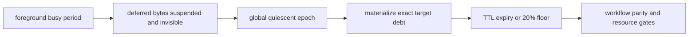

# 有限 TTL 部署压力附录（2026-08-05）

> 2026-08-05 后续更新：本文的 `TTL=2048` 是**等权 deferred scheduling** 的已确认基线。后续 earliest-expiry-first 机制已在独立 81-cell confirmation 中以 `TTL=1536` 通过所有冻结门。最新结论请引用 [Deadline-aware TTL 部署附录](DEADLINE_AWARE_TTL_ADDENDUM_20260805.md)；本文保留用于追溯基线与负结果。

## 当前结论

在冻结的三项因子化控制器参数不变的前提下，采用 **quiescent deferred-background** 语义，并将每个 workflow 的 post-completion TTL 设为 `2048` simulator epochs，独立确认集 `27 scenarios x 3 runs = 81 cells` 同时通过了背景服务、逐 cell/逐 workflow floor、前台反事实 parity、质量和资源预算全部硬门。

这不是“原 simulator 已可部署”的结论。它只说明：若 background 在主请求完成后至少 `2048` epochs 仍具有业务价值，且只能在全局不存在 foreground flow 的 epoch 中物化，则该扩展模型存在一个经过独立确认的可行点。

## 最终确认

来源：[v5 独立确认](results/eligible_window_ttl_confirm_v3_20260805/ELIGIBLE_WINDOW_TTL_STRESS_REPORT.md)。

| 指标 | TTL = 2048 | 无界上界 | 判定 |
|---|---:|---:|---|
| Cells | `81` | `81` | 固定 27 场景 x 3 新 runs |
| Mean background service | `0.228058` | `0.228058` | >= `0.20` |
| Background floor cells | `1.000` | `1.000` | 81/81 |
| Workflow floor | `1.000` | `1.000` | `1e-9` 容差下全部达标 |
| Deferred expiry fraction | `0.000` | `0.000` | 无 TTL 内过期 |
| Foreground parity | `1.000` | `1.000` | action/state/latency/waste 全零 mismatch |
| Mean quality | `0.992527` | `0.992527` | >= `0.95` |
| Delta link utilization | `+0.056229` | `+0.056229` | <= `+0.08` 预算 |
| Mean p95 completion-to-terminal lag | `189.260` epochs | `189.260` epochs | 显式生命周期成本 |
| Mean post-foreground drain | `18.889` epochs | `18.889` epochs | 显式排空成本 |

`2048` 行与无界上界逐指标相同，说明在本确认集内该 TTL 没有截断任何达到 20% floor 所需的 deferred service；这不等价于真实系统的毫秒级 TTL 建议。

## 方法与创新



1. **可见性隔离。** v5 不只令 deferred flow 的权重为零，而是把它从完整 foreground busy period 的 active set 移除，避免它进入 pressure 分母或未来工作流的决策特征。
2. **从 cell 均值升级到逐 workflow floor。** 所有 cell 平均达标不足以排除个别 workflow 饥饿；v5 将每一 workflow 的 `ratio >= 0.20 - 1e-9` 升级为选择和确认硬门。
3. **有限 TTL 边界而非无界假设。** 以 `{0, 64, 256, 512, 1024, 2048}` 的冻结候选扫描最小 TTL，并用独立 ledger 确认最终值，不把无界 deferred service 写成部署结论。
4. **可暂停但不可提前终止的排空。** quiescent 版本额外把“仍有未过期欠额”写入结束条件，防止临时 suspend 被误判为全部工作完成。

## 失败如何改进协议

| 阶段 | 发现 | 处理 | 可引用性 |
|---|---|---|---|
| TTL v2 | 验证集选出的 TTL `512` 在独立确认中仅 `74/81` cells 达到 floor，且 `2.8%` workflows 到期不足 | 把逐 workflow floor 升为硬门 | 失败证据，不能作为可行点 |
| TTL v3 | `2048` 满足服务，但 `1/81` cell 的 speculative waste 有 `0.294249` 差异 | 定位到 completed-owner deferred flow 仍存在于 foreground pressure 特征 | 失败证据，不能作为 parity 结论 |
| Quiescent 原型 | suspend 的 debt 被基础 simulator 误认为无 active flow 而提前结束 | 将 pending deferred debt 加入终止条件，并加入回归测试 | 实现修复，不单独引用 |
| TTL v5 | 新验证选出 `2048`，新确认 `81/81` 通过全部硬门 | 冻结结果 | 当前可引用结论 |

因此，旧 v3 的无界 lifecycle 结果仍保留为机制证据，但有限 TTL 的当前结论必须引用本附录和 v5 confirmation；TTL v2/v3 的负结果不得删除或改写为支持。

## 文献启发与边界

- Dean 与 Barroso 的 [*The Tail at Scale* (CACM 2013)](https://doi.org/10.1145/2408776.2408794) 说明尾部风险不能只由平均值代表，因此这里使用每个 workflow 的反事实 parity 与 floor。
- Barroso 与 Holzle 的 [*The Case for Energy-Proportional Computing* (Computer 2007)](https://doi.org/10.1109/MC.2007.443) 启发了资源成本核算；本工作只报告 link-utilization 增量，**不是**实测能耗。
- 当前没有真实 Agent trace 的业务价值标签、TTL 分布、能耗计、总字节上限或 tenant 标识。`2048` 是 simulator epoch 中的机制边界，不可直接转写为产品 SLO。
- congestion、slack、active speculative backlog 的 broad/nonjoint 三项证明来自此前冻结的因子化控制器确认；本附录通过严格 foreground parity 表明 TTL 机制没有改变该前台轨迹，但没有把 TTL 扫描伪装成新的三项 ablation 证明。

## 复现

从 `organized_code_files/student15267` 目录运行。命令会逐 cell 写入 checkpoint，可安全续跑。

```bash
python3 -B -m specnet_proofs.eligible_window_deployment_stress_study --mode validate \
  --frozen-factorized-candidate specnet_proofs/results/factorized_signal_smoke_v1_20260730/selected_candidate.json \
  --output-dir specnet_proofs/results/eligible_window_ttl_validate_v5_20260805

python3 -B -m specnet_proofs.eligible_window_deployment_stress_study --mode confirm \
  --frozen-factorized-candidate specnet_proofs/results/factorized_signal_smoke_v1_20260730/selected_candidate.json \
  --frozen-ttl-file specnet_proofs/results/eligible_window_ttl_validate_v5_20260805/selected_ttl.json \
  --output-dir specnet_proofs/results/eligible_window_ttl_confirm_v3_20260805
```

## 下周最高优先级

1. 用真实 Agent trace 标注 background 完成后的边际业务价值，判断 `2048` epochs 的前提是否可接受。
2. 将 total bytes、实际能耗或 NIC active time、以及 TTL 内的有效收益纳入 gate；不能继续只以 utilization 代理代替。
3. 加入 tenant 标签和新 foreground 到达的 counterfactual replay，验证 quiescent 隔离在多租户公平定义下仍成立。
