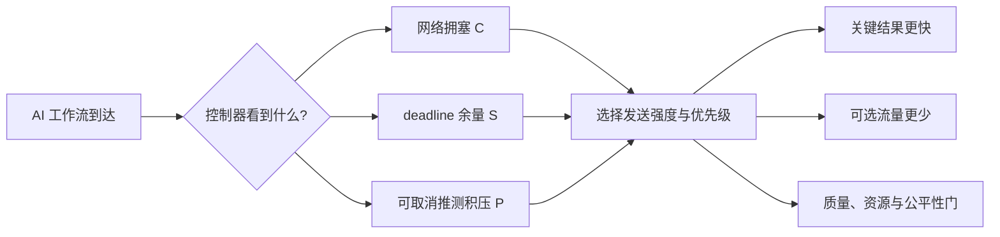

# SpecNet-Agent 项目现在在做什么：通俗说明（2026-08-15）

## 一句话

这个项目把一个会并行调用多个 AI 工具的任务，看成一组要抢同一条网络链路的“车辆”：关键步骤必须尽快到达；可选的推测步骤有用但可能白做；控制器决定什么时候少发、什么时候优先发、什么时候等一等，以同时兼顾速度、质量和资源。

## 项目由三层组成

| 层 | 它是什么 | 现在的状态 |
|---|---|---|
| 上游 SpecNet-Agent | 生成 workload、模拟网络、训练 bandit、输出主实验图表 | GitHub `main` 的 trace snapshot 只读保留；支持 V1/V2/V3 trace-driven profile、质量 guard、path-aware 网络模型 |
| `specnet_proofs` | 独立科研实验室：不改上游，专门检验主张是否真的成立 | 已有 73 个单元测试和版本化结果；所有结论保留正负结果 |
| V4–V7 部署分支 | 处理“质量安全却耗资源太多”的工程问题 | V4/V5 有正向证据；V6/V7 仍是 validation-only 探索，未部署 |

## 三项证明到底证明什么

### 证明一：三个信号真的各有用吗？

控制器看三件事：

- `C`（congestion）：现在网络堵不堵；
- `S`（slack）：这个任务离 deadline 还宽不宽裕；
- `P`（speculative pressure）：队列里有多少可取消的推测工作。

做法是“少看一项，再与完整方案比较”。例如拿掉 C，就专门检查高拥塞时是否更慢；拿掉 P，就专门检查高推测积压时是否浪费更多。

当前结论：通过把三个信号拆到 admission、全局调度、deadline 调度三条路径，synthetic 和 trace-driven V3 的独立实验支持三项机制的可辨识作用。它证明的是**模拟器中这三类信息有价值**，不是“真实生产网络已经证实”。

### 证明二：固定规则能完全替代 bandit 吗？

做法是给规则和 bandit 相同输入、相同 5 个动作、相同质量门、相同调参预算；不能让规则故意变弱。

当前结论：固定规则可以在一些场景做到很好，但没有证据表明一条固定规则跨负载、deadline、optional 工作量和不同 trace profile 都稳定胜过 bandit。V2 validation 到 test 的漂移也说明“在验证集挑出的一个好阈值”未必能迁移。

因此不能宣传“bandit 必然更优”；更准确的说法是：bandit/自适应控制更适合处理变化的环境，但需要更严格的鲁棒性和资源门。

### 证明三：这个控制器能解释、能复现吗？

做法不是只打印 Q 表，而是检查：每种状态有没有足够样本、同一 state+Q 表+guard 能否复现动作、单独改变一个信号是否改变动作、不同随机种子下性能是否仍接近。

当前结论：控制器的决策过程可以审计，且有状态覆盖、反事实和跨 seed 检查；但单次训练的 Q 表不等于“普遍规律”。可解释性成立的边界是“给定本次模型和日志，可以追溯为什么这么选”，不是“模型在任何数据上都一样”。

## 为什么后来资源消耗变大

质量 guard 为了让 optional 结果在 judge 前真正完成，会把原本可能取消的可选流量也服务掉。因此质量从约 `0.785` 提到约 `0.9995` 时，served bytes、利用率、waste 和 P99 都可能上升。这是质量—资源交换，不是单纯 bug。

此外，旧 synthetic 快照的 capacity scale 曾只改变状态估计、没有同步改变实际服务池；V5 已在派生 simulator 中修正。旧的容量缩放结果和 V5 后的结果必须分开报告。

## 最近的具体优化做了什么

| 版本 | 核心想法 | 结果 |
|---|---|---|
| V4 | 只保留达到质量目标所需的最小 optional 子集 | 明显减少 static `100×` guard 的多余服务 |
| V5 | 关键分支完成约 75% 后，再提升 selected optional 的优先级；同步修正实际服务容量 | V1/V3 外部 profile 通过核心门；V2 有小幅 P99 回归，不能说通用成功 |
| V6 | 终端优先级按剩余 optional 字节/可观察完成窗口动态调节 | 总体均值优于 V5，但少数场景的 bytes/utilization 回归；仅探索性 |
| V7 | 高资源压力时从 V6 回退到 V5 | V1/V2 平均 bytes 仅小幅改善；仍有逐场景失败，未晋升主策略 |

V7 最近 validation（9 场景×3 paired runs）中，相对 V5：V1 served bytes 约少 `0.74`，但 P99 多 `0.02`；V2 served bytes 约少 `0.75`，P99 相同。该幅度很小，且 V1 有 2 个、V2 有 4 个场景未通过逐场景资源门。因此它是诚实保留的尝试，不是成功部署结果。

## 建设性意见：下一步该怎么做

1. **停止继续手调固定阈值。** V2 的 validation→test 漂移说明再扩网格的收益有限。应改为预注册的 group-robust 选择：候选必须在容量、deadline、负载、optional bytes 各组都满足预算。
2. **实现 virtual byte-debt，而不是只改 priority。** 每个 workflow 和全局都维护“多花了多少 bytes”的账户；预算足够才使用温和 V6，超过预算立即切到经验证的 V5 或 V4。这样资源约束进入控制决策本身。
3. **把资源门改成合理的统计门。** 逐个随机 replay 要求绝对零差值会把随机噪声当失败；应预注册场景分层 paired CI、实际 bytes 容忍预算和最差场景 P95/P99，同时保留每一场景明细。
4. **严格数据隔离。** V1/V2 validation 用于选策略；V3 与 V2 test 只用于最终确认。不得根据 test 结果回调参数。
5. **优先真实系统验证。** simulator 的 quality、energy 和 trace 都是 proxy。下一阶段至少接入真实 token/byte 计数、真实质量评测、突发容量下降和 tenant-level fairness。

## 当前最准确的项目表述

> SpecNet-Agent 的隔离实验支持网络拥塞、deadline 余量和可取消推测积压对模拟器内控制决策有可审计价值。质量安全机制能够改善完成质量，但存在明确的资源与尾延迟代价。V5 是当前最成熟的资源修正方案；V6/V7 仍需通过独立、跨 profile 的资源鲁棒性确认，不能作为已部署优化。

